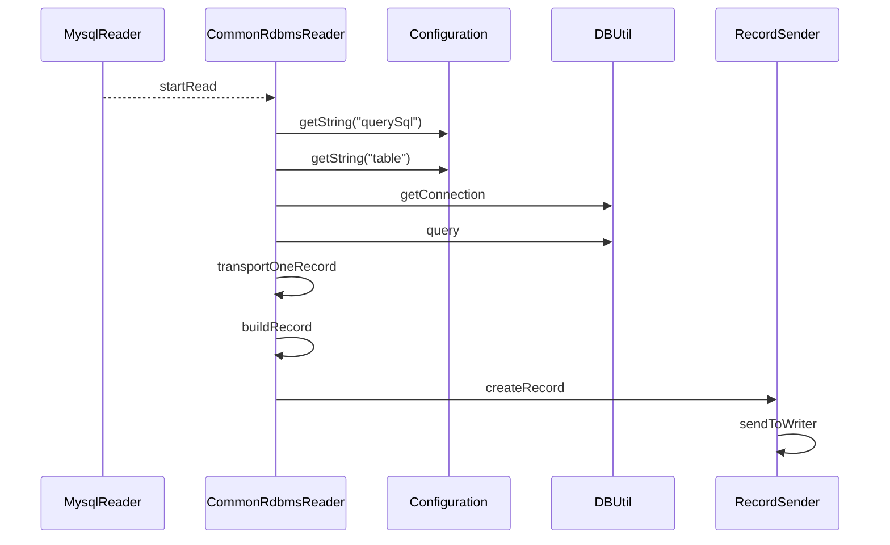
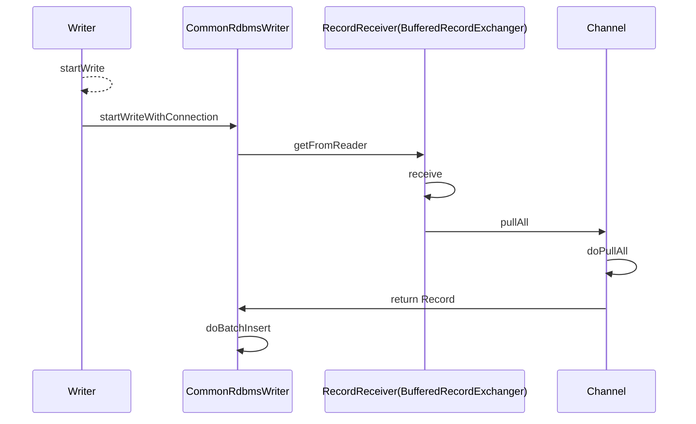

> {{ page.description }}

# 前言
借助GPT理解代码。开源 Datax 是数据集成比较常用的工具，满足一般中小公司的场景使用，通常数据库数据不会有几百TB的场景。

# 设计理念
为了解决异构数据源同步问题，DataX将复杂的网状的同步链路变成了星型数据链路，DataX作为中间传输载体负责连接各种数据源。当需要接入一个新的数据源的时候，只需要将此数据源对接到DataX，便能跟已有的数据源做到无缝数据同步。

# DataX 阅读理解
带着问题阅读
1. 数据读取之后临时存在哪，以什么格式。并发读取考虑到性能问题了吗
2. 如何保证数据一致性，如果中断了怎么处理

DataX作为一款高性能的异构数据源同步工具，要解决的第一个难点是异构数据基本单位的统一抽象，为此，DataX将每一条数据全部抽象为Record，每一条Record中包含了多个Column，具体代码实现如下：

```java
// 数据抽象接口，一条数据将具有以下特性
public interface Record {
    // 增加一列
	public void addColumn(Column column);
    // 设置某一列
	public void setColumn(int i, final Column column);
    // 获取某一列
	public Column getColumn(int i);
	public String toString();
    // 获取列数
	public int getColumnNumber();
    // 获取数据占用字节数，单位为byte
	public int getByteSize();
    // 获取数据占用内存数，指的是对象头占用的内存，单位为byte
	public int getMemorySize();
}
```


在基于这一层抽象的基础上，DataX对于Record有三种不同的实现，分别是：
- `com.alibaba.datax.core.transport.record.DefaultRecord`: 异构数据源传输时的成功记录
- `com.alibaba.datax.core.statistics.plugin.task.util.DirtyRecord`: 异构数据源之间传输时的失败记录，特指脏数据
- `com.alibaba.datax.core.transport.record.TerminateRecord`: 标识传输终止的记录

```java
// 列抽象类
public abstract class Column {
    
	// 列类型
	private Type type;
    
	// 列值
	private Object rawData;
    
	// 列占用的字节数
	private int byteSize;

	public abstract Long asLong();

	public abstract Double asDouble();

	public abstract String asString();

	public abstract Date asDate();
	
	public abstract Date asDate(String dateFormat);

	public abstract byte[] asBytes();

	public abstract Boolean asBoolean();

	public abstract BigDecimal asBigDecimal();

	public abstract BigInteger asBigInteger();

	public enum Type {
		BAD, NULL, INT, LONG, DOUBLE, STRING, BOOL, DATE, BYTES
	}    
}
```
 
在基于这一层抽象的基础上，DataX对于 Column 有七种不同的实现，分别是：
- BoolColumn
- BytesColumn
- DateColumn 
- DoubleColumn
- LongColumn
- StringColumn
- DirtyColumn

列类型之间互转，通过 `ColumnCast` 
- BytesCast->String
- DateCast -> String
- StringCast -> Data,StringCast -> Bytes


# 运行模型


# Transformer定义

在数据同步、传输过程中，存在用户对于数据传输进行特殊定制化的需求场景，包括裁剪列、转换列等工作，可以借助ETL的T过程实现(`Transformer`)。DataX包含了完整的E(`Extract`)、T(`Transformer`)、L(`Load`)支持。

```java
public abstract class Transformer {
    //transformerName的唯一性在datax中检查，或者提交到插件中心检查。
    private String transformerName;
	
    /**
     * @param record 行记录，UDF进行record的处理后，更新相应的record
     * @param paras  transformer函数参数
     */
    abstract public Record evaluate(Record record, Object... paras);
}
```

- **DigestTransformer**：计算指定字段的摘要值，如 MD5、SHA-256，用于生成哈希值或签名。
- **FilterTransformer**：根据条件过滤数据行，如果某行数据不满足条件，可以将其过滤掉。
- **GroovyTransformer**：使用 Groovy 脚本对数据进行复杂的自定义处理，允许灵活编写脚本以满足特定需求。
- **PadTransformer**：对字符串进行补齐操作，可以在字符串的前面或后面添加指定字符，使其达到指定长度。
- **ReplaceTransformer**：用指定的值替换数据中的某些内容，常用于数据清洗。
- **SubstrTransformer**：从字符串中提取子串，根据起始位置和长度截取字段内容。

# DataX 抽数过程 - DBMS


## DataX 取数 - DBMS


```java
	private final List<Record> buffer;
	@Override
	public void sendToWriter(Record record) {

		Validate.notNull(record, "record不能为空.");

		boolean isFull = (this.bufferIndex >= this.bufferSize || this.memoryBytes.get() + record.getMemorySize() > this.byteCapacity);
		if (isFull) {
			flush();
		}

		this.buffer.add(record);
		this.bufferIndex++;
		memoryBytes.addAndGet(record.getMemorySize());
	}
```

通过 `sendToWriter` 方法，可以发现是将数据保存在内存中的，没有直接写出，在写入的数据量达到设置的阈值后，就会刷出。
这里展示的 `sendToWriter` 是 `RecordExchanger` 基础实现，在 `DataX` 中有三种实现方式：
1. `RecordExchanger：这是最基础的交换器，负责直接在` `Reader` 和 `Writer` 之间传递数据记录，通常不涉及缓冲或批处理。
2. `BufferedRecordExchanger：它在` `RecordExchanger` 的基础上增加了缓冲功能，使用缓冲区来存储数据，允许一次传输多个记录，从而提高性能。
3. `BufferedRecordTransformerExchanger`：它不仅具有缓冲功能，还支持在传输过程中对数据记录进行转换或处理，例如数据格式转换或字段修改。

```java
	@Override
	public void flush() {
		if(shutdown){
			throw DataXException.asDataXException(CommonErrorCode.SHUT_DOWN_TASK, "");
		}
		this.channel.pushAll(this.buffer);
		this.buffer.clear();
		this.bufferIndex = 0;
		this.memoryBytes.set(0);
	}
```
`Channel` 的主要作用包括：
1. 数据缓冲：在数据传输过程中提供一个缓冲区，确保数据在 Reader 和 Writer 之间的平稳流动。
2. 并发控制：支持并发的数据传输，提升数据同步的效率。
3. 数据传输的调度：管理数据从 Reader 到 Writer 的整个流程，确保数据传输的正确性和可靠性。
4. 多线程支持：`Channel` 通过多线程的方式来提高数据传输的并发性，使得数据可以在多个线程中并行处理，从而加速传输过程。
5. 数据分片处理：`Channel` 可以将数据切分成更小的块进行处理，特别适合大数据量的场景。每个分片可以在不同的线程中处理，进一步提升传输效率。
6. 错误处理与恢复：`Channel` 包含了错误处理机制，可以在传输过程中捕获并处理错误，同时支持数据的断点续传。
7. 流量控制：`Channel` 还可以进行数据流量的控制，防止数据传输的突发流量对系统造成冲击。

`Channel` 底层定义如下:
```java
/**
 * Created by jingxing on 14-8-25.
 * <p/>
 * 统计和限速都在这里
 */
public abstract class Channel {

    private static final Logger LOG = LoggerFactory.getLogger(Channel.class);

    protected int taskGroupId;

    protected int capacity;

    protected int byteCapacity;

    protected long byteSpeed; // bps: bytes/s

    protected long recordSpeed; // tps: records/s

    protected long flowControlInterval;
	//...
}
/**
 * 内存Channel的具体实现，底层其实是一个ArrayBlockingQueue
 *
 */
public class MemoryChannel extends Channel {
	private int bufferSize = 0;

	private AtomicInteger memoryBytes = new AtomicInteger(0);

	private ArrayBlockingQueue<Record> queue = null;

	private ReentrantLock lock;

	private Condition notSufficient, notEmpty;

	public MemoryChannel(final Configuration configuration) {
		super(configuration);
		this.queue = new ArrayBlockingQueue<Record>(this.getCapacity());
		this.bufferSize = configuration.getInt(CoreConstant.DATAX_CORE_TRANSPORT_EXCHANGER_BUFFERSIZE);

		lock = new ReentrantLock();
		notSufficient = lock.newCondition();
		notEmpty = lock.newCondition();
	}	
}
```
`DataX` 的 `MemoryChannel` 中，使用 `ArrayBlockingQueue` `的主要目的是为了在数据传输过程中提供一个有界的缓冲区。ArrayBlockingQueue` 是一个线程安全的阻塞队列，它可以在多线程环境中用于控制生产者（Reader）和消费者（Writer）之间的数据流动。
具体来说，`ArrayBlockingQueue` 带来的好处包括：

- **流量控制**：通过设定队列的大小，避免生产者过快地生成数据而使消费者无法及时处理，防止内存溢出。
- **并发处理**：支持多线程环境下的数据传输，确保线程安全的同时提高传输效率。
- **阻塞与同步**：在队列为空或已满时，ArrayBlockingQueue 会自动阻塞相应的线程，确保数据在适当时机被消费或生产，防止资源浪费。
这种设计使得 MemoryChannel 能够在多线程环境中高效、安全地进行数据传输，是 DataX 中数据通道设计的核心。

调用 `Channel` 的 `pushAll` 的操作如下:
```java
    public void pushAll(final Collection<Record> rs) {
        Validate.notNull(rs);
        Validate.noNullElements(rs);
        this.doPushAll(rs);
        this.statPush(rs.size(), this.getByteSize(rs));
    }

	@Override
	protected void doPushAll(Collection<Record> rs) {
		try {
			long startTime = System.nanoTime();
			lock.lockInterruptibly();
			int bytes = getRecordBytes(rs);
			while (memoryBytes.get() + bytes > this.byteCapacity || rs.size() > this.queue.remainingCapacity()) {
				notSufficient.await(200L, TimeUnit.MILLISECONDS);
            }
			// 入队列
			this.queue.addAll(rs);
			waitWriterTime += System.nanoTime() - startTime;
			memoryBytes.addAndGet(bytes);
			// 有数据的信号发送
			notEmpty.signalAll();
		} catch (InterruptedException e) {
			throw DataXException.asDataXException(
					FrameworkErrorCode.RUNTIME_ERROR, e);
		} finally {
			lock.unlock();
		}
	}
```

这里有个有意思的方法 `notEmpty.signalAll()` 这个是 Java 条件锁。当读出的数据放入到队列之后进行一个唤醒的操作，这种情况应该发生在高延迟的情况下才需要，但是每次读取后会会有一个唤醒。
对唤醒稍加改造就是一个分布式的消费动作。当然数据也不会只放在内存中，而是第三方容器中比如 `MQ`、`Redis` 等。


## DataX 抽数过程 - DBMS


# DataX 写数 - DBMS

当数据读取完成后，并且会写数的过程进行了一个唤醒的操作，那么就看下唤醒的操作被哪里共用了。

```java
	@Override
	protected void doPullAll(Collection<Record> rs) {
		assert rs != null;
		rs.clear();
		try {
			long startTime = System.nanoTime();
			lock.lockInterruptibly();
			while (this.queue.drainTo(rs, bufferSize) <= 0) {
				notEmpty.await(200L, TimeUnit.MILLISECONDS);
			}
			waitReaderTime += System.nanoTime() - startTime;
			int bytes = getRecordBytes(rs);
			memoryBytes.addAndGet(-bytes);
			notSufficient.signalAll();
		} catch (InterruptedException e) {
			throw DataXException.asDataXException(
					FrameworkErrorCode.RUNTIME_ERROR, e);
		} finally {
			lock.unlock();
		}
	}
```
`doPullAll` 方法里做了一个 `this.queue.drainTo` 的操作
- drainTo()从指定的队列中移除所有可用的元素，并将它们添加到给定的集合中。
- 它提供了比逐一轮询所有元素更好的性能。
- 如果在 `drain` 过程中，所提供的集合被修改，那么这个方法的行为将无法定义。
- 对于通用集合，不兼容的类类型将导致 `ClassCastException`。

到这里的代码其实应该进行思考了开发者的设计默认和合理性，为什么不用 `COW` 模型进行一个投递操作而是使用整段整段的操作。可能是为了限流？实现方式千千万各取所需即可。如果一开始自己实现会用什么方式呢？

接下来看下具体消费流程，根据这个线索往上排查:



通过上面的使用分析发现逻辑基本闭环，知道了来源知道了去处。看下具体的方法实现

```java
        // TODO 改用连接池，确保每次获取的连接都是可用的（注意：连接可能需要每次都初始化其 session）
        public void startWrite(RecordReceiver recordReceiver,
                               Configuration writerSliceConfig,
                               TaskPluginCollector taskPluginCollector) {
            Connection connection = DBUtil.getConnection(this.dataBaseType,
                    this.jdbcUrl, username, password);
            DBUtil.dealWithSessionConfig(connection, writerSliceConfig,
                    this.dataBaseType, BASIC_MESSAGE);
            startWriteWithConnection(recordReceiver, taskPluginCollector, connection);
        }
```

当 startWrite 被调用后就开始获取链接然后直接调用 `startWriteWithConnection`。

```java
      public void startWriteWithConnection(RecordReceiver recordReceiver, TaskPluginCollector taskPluginCollector, Connection connection) {
            this.taskPluginCollector = taskPluginCollector;
            // 用于写入数据的时候的类型根据目的表字段类型转换
            this.resultSetMetaData = DBUtil.getColumnMetaData(connection,
                    this.table, StringUtils.join(this.columns, ","));
            // 写数据库的SQL语句
            calcWriteRecordSql();
            List<Record> writeBuffer = new ArrayList<Record>(this.batchSize);
            int bufferBytes = 0;
                Record record;
                while ((record = recordReceiver.getFromReader()) != null) {
                    writeBuffer.add(record);
                    bufferBytes += record.getMemorySize();

                    if (writeBuffer.size() >= batchSize || bufferBytes >= batchByteSize) {
                        doBatchInsert(connection, writeBuffer);
                        writeBuffer.clear();
                        bufferBytes = 0;
                    }
                }
                if (!writeBuffer.isEmpty()) {
                    doBatchInsert(connection, writeBuffer);
                    writeBuffer.clear();
                    bufferBytes = 0;
                }
        }
```
对代码进行了一些剪裁只保留了核心的代码.这里有一个 `getFromReader` 的方法调用，当返回不为空的时候会一直调用。有意思的是什么时候会返回空之前的代码没有数据一直都是 wait 状态。所以按照这个逻辑应该不会一直结束，所以再看下  `getFromReader` 的具体操作.

```java
	@Override
	public Record getFromReader() {
		boolean isEmpty = (this.bufferIndex >= this.buffer.size());
		if (isEmpty) {
			receive();
		}
		Record record = this.buffer.get(this.bufferIndex++);
		if (record instanceof TerminateRecord) {
			record = null;
		}
		return record;
	}
```
看见了最终的执行代码逻辑就是如果接收到的是 `TerminateRecord` 类型的数据就直接返回空已结束数据同步.知道了如何结束需要知道其来源也就是 `this.buffer.get` 前提是 `buffer` 不为空，如果为空会触发 `receive` 方法：

```java
	private void receive() {
		this.channel.pullAll(this.buffer);
		this.bufferIndex = 0;
		this.bufferSize = this.buffer.size();
	}
```
这里调用的是 `Channel` 的 pullAll 方法
```java
    public void pullAll(final Collection<Record> rs) {
        Validate.notNull(rs);
        this.doPullAll(rs);
        this.statPull(rs.size(), this.getByteSize(rs));
    }

	// MemoryChannel 
	@Override
	protected void doPullAll(Collection<Record> rs) {
		assert rs != null;
		rs.clear();
		try {
			long startTime = System.nanoTime();
			lock.lockInterruptibly();
			while (this.queue.drainTo(rs, bufferSize) <= 0) {
				notEmpty.await(200L, TimeUnit.MILLISECONDS);
			}
			waitReaderTime += System.nanoTime() - startTime;
			int bytes = getRecordBytes(rs);
			memoryBytes.addAndGet(-bytes);
			notSufficient.signalAll();
		} catch (InterruptedException e) {
			throw DataXException.asDataXException(
					FrameworkErrorCode.RUNTIME_ERROR, e);
		} finally {
			lock.unlock();
		}
	}
```

这里就完成了数据闭环，pushAll 将数据推送到 `ArrayBlockingQueue` 。`doPullAll` 将数据全部取出到写 `buffer` 中，完成消费并插入到数据库中。

# 总结
阅读理解了 DataX 核心链路的打通，知道了数据如何来源知道了数据去向，中间的解耦与数据耦合，在 `MemoryChannel` 中。发现还是有很多事可以做的获取链接的优化，比如：从连接池获取，`Channel` 实现扩展，当前 `MemoryChannel` 使用还是有弊端的比如使用 `ArrayBlockingQueue` 存在一定的性能影响。比如如果运行中断了会导致数据丢失从头开始 。可以设计分布式实现这些功能.

---
参考：
- [DataX源码解析](https://tyrantlucifer.com/datax-02.html){:target='blank'}