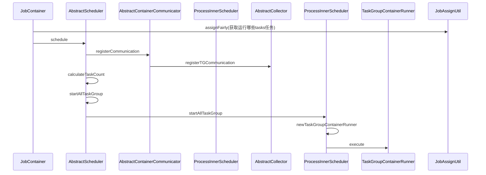
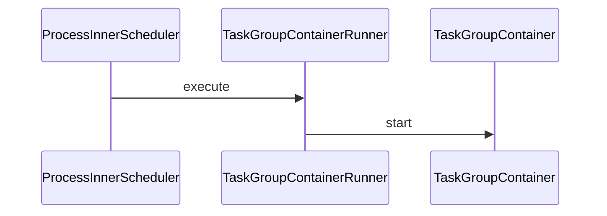

> {{ page.description }}

# 前言
借助GPT理解代码。开源 Datax 是数据集成比较常用的工具，满足一般中小公司的场景使用，通常数据库数据不会有几百TB的场景。

# 设计理念
为了解决异构数据源同步问题，DataX将复杂的网状的同步链路变成了星型数据链路，DataX作为中间传输载体负责连接各种数据源。当需要接入一个新的数据源的时候，只需要将此数据源对接到DataX，便能跟已有的数据源做到无缝数据同步。

# DataX 阅读理解
带着问题阅读
1. 怎么调度，任务怎么切割，线程怎么分配，何时运行抽数何时运行写数
2. 如何合理使用资源

DataX 开源的因为是 `Standalone` 模式的，所以所有任务的切割都是线程级别，然后在按照线程分组。形成多任务多线运行任务，最终还是落在单实例上运行，所以不会有很复杂的情况。大概执行路径如下：



总体的任务分割在 JobAssignUtil 类下，分割任务之前需要获取一些基本参数代码如下：

```java
    /**
     * schedule首先完成的工作是把上一步reader和writer split的结果整合到具体taskGroupContainer中,
     * 同时不同的执行模式调用不同的调度策略，将所有任务调度起来
     */
    private void schedule() {
        /**
         * 这里的全局speed和每个channel的速度设置为B/s
         */
		// 每个 taskGroup 中要执行的任务数量
        int channelsPerTaskGroup=this.configuration.getInt(CoreConstant.DATAX_CORE_CONTAINER_TASKGROUP_CHANNEL, 5);
        // 总任务数量
		int taskNumber = this.configuration.getList(CoreConstant.DATAX_JOB_CONTENT).size();
		// 实际需要 Channel 的数量和总任务数量取最小值，防止 Channel 数量多于任务数量
        this.needChannelNumber = Math.min(this.needChannelNumber, taskNumber);
        /**
         * 通过获取配置信息得到每个taskGroup需要运行哪些tasks任务
         */
        List<Configuration> taskGroupConfigs = JobAssignUtil.assignFairly(this.configuration,this.needChannelNumber, channelsPerTaskGroup);
```

`DataX` 中的 `JobAssignUtil.assignFairly` 方法的作用是将任务（`Job`）在多个通道（`Channel`）之间进行公平分配。该方法确保各个通道分配的任务数量尽可能均衡，从而优化数据传输的性能和效率。这对于数据量较大的任务尤为重要，可以防止某些通道负载过高而影响整体任务的执行速度。通过这种分配机制，DataX 能够更有效地利用系统资源，提高任务执行的并发性和吞吐量。

```java
/**
     * 公平的分配 task 到对应的 taskGroup 中。
     * 公平体现在：会考虑 task 中对资源负载作的 load 标识进行更均衡的作业分配操作。
     *
     * @param configuration
     * @param channelNumber Channel 数量
     * @param channelsPerTaskGroup 每个 taskGroup 中要执行的任务数量
     */
    public static List<Configuration> assignFairly(Configuration configuration, int channelNumber, int channelsPerTaskGroup) {
        int taskGroupNumber = (int) Math.ceil(1.0 * channelNumber / channelsPerTaskGroup);
        LinkedHashMap<String, List<Integer>> resourceMarkAndTaskIdMap;
        List<Configuration> taskGroupConfig = doAssign(resourceMarkAndTaskIdMap, configuration, taskGroupNumber);
        // 调整 每个 taskGroup 对应的 Channel 个数（属于优化范畴）
        adjustChannelNumPerTaskGroup(taskGroupConfig, channelNumber);
        return taskGroupConfig;
    }

    /**
     * 
     * 需要实现的效果通过例子来说是：
     * <pre>
     * a 库上有表：0, 1, 2
     * b 库上有表：3, 4
     * c 库上有表：5, 6, 7
     *
     * 如果有 4个 taskGroup
     * 则 assign 后的结果为：
     * taskGroup-0: 0,  4,
     * taskGroup-1: 3,  6,
     * taskGroup-2: 5,  2,
     * taskGroup-3: 1,  7
     *
     * </pre>
     */
    private static List<Configuration> doAssign(LinkedHashMap<String, List<Integer>> resourceMarkAndTaskIdMap, Configuration jobConfiguration, int taskGroupNumber) {
        List<Configuration> contentConfig = jobConfiguration.getListConfiguration(CoreConstant.DATAX_JOB_CONTENT);
		// 获取所有同步任务内容
        Configuration taskGroupTemplate = jobConfiguration.clone();
		// 从原模板内容中去除数据
        taskGroupTemplate.remove(CoreConstant.DATAX_JOB_CONTENT);
		
        List<Configuration> result = new LinkedList<Configuration>();
		// 初始化任务量
        List<List<Configuration>> taskGroupConfigList = new ArrayList<List<Configuration>>(taskGroupNumber);
        for (int i = 0; i < taskGroupNumber; i++) {
            taskGroupConfigList.add(new LinkedList<Configuration>());
        }

        int mapValueMaxLength = -1;

    // 获取任务编号，并给每个任务一个标记，每个任务的标记都一致，用一个map保存，标记 -> 编号
        List<String> resourceMarks = new ArrayList<String>();
        for (Map.Entry<String, List<Integer>> entry : resourceMarkAndTaskIdMap.entrySet()) {
            resourceMarks.add(entry.getKey());
            if (entry.getValue().size() > mapValueMaxLength) {
                mapValueMaxLength = entry.getValue().size();
            }
        }
    	// 核心Round Robin分配逻辑
        int taskGroupIndex = 0;
        for (int i = 0; i < mapValueMaxLength; i++) {
            for (String resourceMark : resourceMarks) {
                if (resourceMarkAndTaskIdMap.get(resourceMark).size() > 0) {
                    int taskId = resourceMarkAndTaskIdMap.get(resourceMark).get(0);
					// 模除算法合理分配数量
                    taskGroupConfigList.get(taskGroupIndex % taskGroupNumber).add(contentConfig.get(taskId));
                    taskGroupIndex++;

                    resourceMarkAndTaskIdMap.get(resourceMark).remove(0);
                }
            }
        }
		// 均衡分配后重新设置 job.content 内容
        Configuration tempTaskGroupConfig;
        for (int i = 0; i < taskGroupNumber; i++) {
            tempTaskGroupConfig = taskGroupTemplate.clone();
            tempTaskGroupConfig.set(CoreConstant.DATAX_JOB_CONTENT, taskGroupConfigList.get(i));
            tempTaskGroupConfig.set(CoreConstant.DATAX_CORE_CONTAINER_TASKGROUP_ID, i);

            result.add(tempTaskGroupConfig);
        }

        return result;
    }
```

为什么获取后要去除模板中的内容？但是这里并没有显示代码把 Table 拍平。

然后调用 `adjustChannelNumPerTaskGroup` 调整 taskGroup 对应的 `Channel` 数量:

```java
    private static void adjustChannelNumPerTaskGroup(List<Configuration> taskGroupConfig, int channelNumber) {
        int taskGroupNumber = taskGroupConfig.size();
        int avgChannelsPerTaskGroup = channelNumber / taskGroupNumber;
        int remainderChannelCount = channelNumber % taskGroupNumber;
        // 表示有 remainderChannelCount 个 taskGroup,其对应 Channel 个数应该为：avgChannelsPerTaskGroup + 1；
        // （taskGroupNumber - remainderChannelCount）个 taskGroup,其对应 Channel 个数应该为：avgChannelsPerTaskGroup

        int i = 0;
        for (; i < remainderChannelCount; i++) {
            taskGroupConfig.get(i).set(CoreConstant.DATAX_CORE_CONTAINER_TASKGROUP_CHANNEL, avgChannelsPerTaskGroup + 1);
        }

        for (int j = 0; j < taskGroupNumber - remainderChannelCount; j++) {
            taskGroupConfig.get(i + j).set(CoreConstant.DATAX_CORE_CONTAINER_TASKGROUP_CHANNEL, avgChannelsPerTaskGroup);
        }
    }
```

代码可以列为冗余一个 `Channel`.

接下来就是调度行为了，任务切分好了，`Channel` 资源也分配好了只需要执行就可以了

```java
        ExecuteMode executeMode = null;
        AbstractScheduler scheduler = initStandaloneScheduler(this.configuration);
        
        	executeMode = ExecuteMode.STANDALONE;

            //设置 executeMode
            for (Configuration taskGroupConfig : taskGroupConfigs) {
                taskGroupConfig.set(CoreConstant.DATAX_CORE_CONTAINER_JOB_MODE, executeMode.getValue());
            }

            scheduler.schedule(taskGroupConfigs);
```
这里代码做了一些剪裁，只保留了核心代码，应为当前 DataX 只支持 `STANDALONE` 模式，所以代码相对没有那么多。这里先对 `Scheduler` 做了初始化操作
```java
    private AbstractScheduler initStandaloneScheduler(Configuration configuration) {
        AbstractContainerCommunicator containerCommunicator = new StandAloneJobContainerCommunicator(configuration);
        super.setContainerCommunicator(containerCommunicator);

        return new StandAloneScheduler(containerCommunicator);
    }
```

**`AbstractContainerCommunicator`** 是一个抽象类，通常用于定义和实现 `DataX` 中容器（container）与外部系统之间的通信机制。在 `DataX` 框架中，容器通常指的是任务执行的进程或线程，而通信机制涉及如何在这些容器之间、以及容器与数据源之间传递信息和数据。这个类的主要作用包括：

1. 定义通信协议
`AbstractContainerCommunicator` 类通常定义了容器之间或容器通信协议和接口。它提供了必要的方法和机制，以便在不同组件之间传递消息、任务、状态等信息。

2. 实现通信功能
该类实现了一些基本的通信功能，比如：
- **发送和接收消息**：处理容器与外部系统之间的消息传递，确保信息能够准确地从发送端到达接收端。
- **数据传输**：负责数据的序列化和反序列化，确保数据能够在不同系统之间正确地传递。
3. 提供抽象接口
作为一个抽象类，它提供了一个通用的接口，供具体的通信实现类继承和实现。这些具体实现类将根据不同的通信协议和需求，扩展 `AbstractContainerCommunicator` 提供的方法，以满足特定的功能需求。

然后就是执行 `schedule` 方法了:
```java

    public void schedule(List<Configuration> configurations) {
        int jobReportIntervalInMillSec = configurations.get(0).getInt(CoreConstant.DATAX_CORE_CONTAINER_JOB_REPORTINTERVAL, 30000);
        int jobSleepIntervalInMillSec = configurations.get(0).getInt(CoreConstant.DATAX_CORE_CONTAINER_JOB_SLEEPINTERVAL, 10000);

        this.jobId = configurations.get(0).getLong(CoreConstant.DATAX_CORE_CONTAINER_JOB_ID);

        errorLimit = new ErrorRecordChecker(configurations.get(0));

        /**
         * 给 taskGroupContainer 的 Communication 注册
         */
        this.containerCommunicator.registerCommunication(configurations);
		// 开始执行每个线程组
        startAllTaskGroup(configurations);

        Communication lastJobContainerCommunication = new Communication();
		// 下面的代码是收集状态信息，并进行上报
    }
```

这里代码将上面创建的 `Communicator` 注册到当前任务，然后开始调用 `startAllTaskGroup`.


`startAllTaskGroup` 具体操作


```java
    @Override
    public void startAllTaskGroup(List<Configuration> configurations) {
		// 新建一个线程池
        this.taskGroupContainerExecutorService = Executors
                .newFixedThreadPool(configurations.size());

        for (Configuration taskGroupConfiguration : configurations) {
			// 注册taskGroup任务到线程池中并启动
            TaskGroupContainerRunner taskGroupContainerRunner = newTaskGroupContainerRunner(taskGroupConfiguration);
            this.taskGroupContainerExecutorService.execute(taskGroupContainerRunner);
        }
    	// 关闭线程池提交线程的入口
        this.taskGroupContainerExecutorService.shutdown();
    }
```	

实际上DataX底层对于每个taskGroup都启动了一个线程TaskGroupContainerRunner，采用线程池的方式实现并发操作

实际运行中的代码片段
```java
            
            this.containerCommunicator.registerCommunication(taskConfigs);

            Map<Integer, Configuration> taskConfigMap = buildTaskConfigMap(taskConfigs); //taskId与task配置
            List<Configuration> taskQueue = buildRemainTasks(taskConfigs); //待运行task列表
            Map<Integer, TaskExecutor> taskFailedExecutorMap = new HashMap<Integer, TaskExecutor>(); //taskId与上次失败实例
            List<TaskExecutor> runTasks = new ArrayList<TaskExecutor>(channelNumber); //正在运行task
            Map<Integer, Long> taskStartTimeMap = new HashMap<Integer, Long>(); //任务开始时间
```
1. 构建 taskId 与 task 映射
2. 构建待运行的 task，初始进来所有的 task 都是待运行的状态
3. 构建存放失败的 task容器
4. 构建存放正在运行的 task

```java
				boolean failedOrKilled = false;
				// 存放已经运行完成的 task
            	Map<Integer, Communication> communicationMap = containerCommunicator.getCommunicationMap();
            	for(Map.Entry<Integer, Communication> entry : communicationMap.entrySet()){
            		Integer taskId = entry.getKey();
            		Communication taskCommunication = entry.getValue();
					// 判断当前任务是否运行完成
					// this.state == State.SUCCEEDED || this.state == State.FAILED	|| this.state == State.KILLED
                    if(!taskCommunication.isFinished()){
                        continue;
                    }
					// 如果运行完成会从正在运行的队列删除这个任务
                    TaskExecutor taskExecutor = removeTask(runTasks, taskId);
```


# 总结


---
参考：
- [DataX源码解析](https://tyrantlucifer.com/datax-02.html){:target='blank'}
