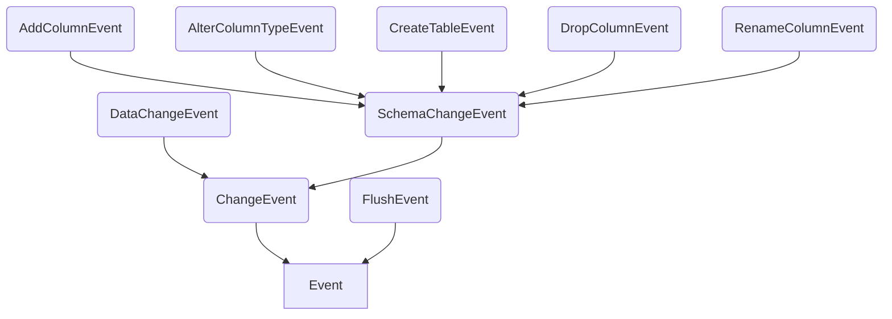
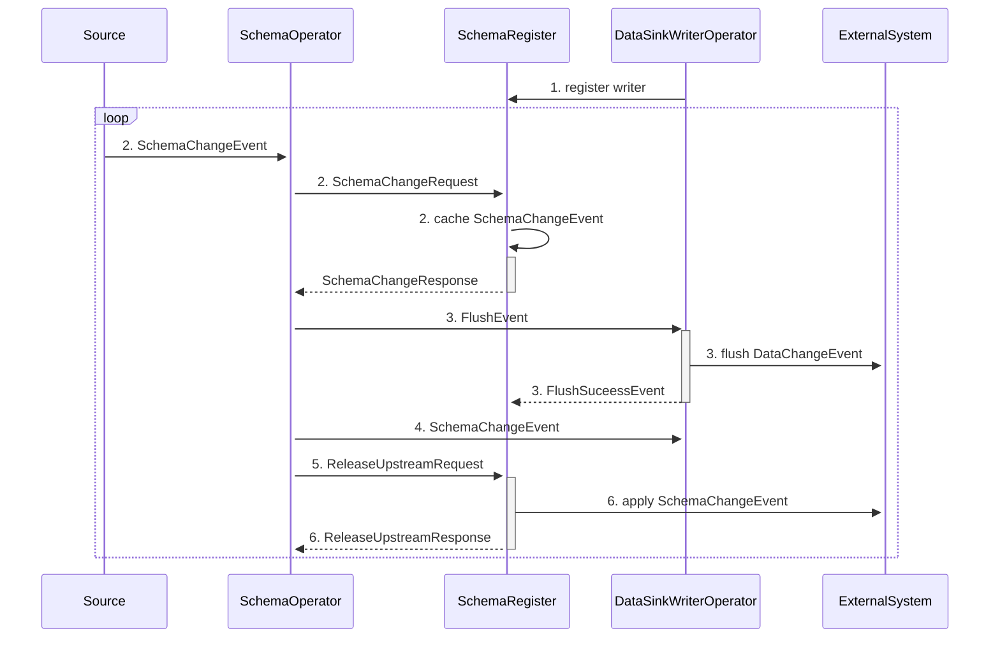

> {{ page.description }}
# 动机
对目前所做工作的进一步演化，行业内知识对标

# Flink CDC 概述
Flink CDC 是基于数据库日志 CDC（Change Data Capture）技术的实时数据集成框架，支持了全增量一体化、无锁读取、并行读取、表结构变更自动同步、分布式架构等高级特性。

# Flink CDC 3.0 设计动机

之前使用 Flink CDC 2.x 调整表结构过程涉及到多个系统组件的手动执行：
- 暂停作业
- 记录 savepoint
- 同步更新上下游数据库 Schema
- 最后从保存点恢复作业。
这一过程不仅引入了数据同步的延迟，还存在因 Schema 不同步导致的作业稳定性风险，而这些问题超出了 Flink CDC 作为单一 Source connector 所能解决的能力范畴。


- 历史数据规模大：数据库的历史数据规模大，100T+ 规模很常见
- 增量数据实时性要求高：数据库的增量数据业务价值高，且价值随时间递减，需要实时处理
- 数据的保序性：CDC 数据的加工结果通常需要强一致性语义，需要处理工具支持全局保序
- 表结构动态变化：增量数据随时间增长，数据对应的表结构会不断演进

历史问题：
1. 使用复杂
    - 只是一组 Flink Source Connector
    - 不提供端到端数据集成
    - 使用需要编写 SQL/Java 代码
2. 可扩展性不足
    - 不支持自定义数据结构写入拓扑
    - 不支持全量和增量阶段的扩缩容
    - 自资源消耗大
3. 不支持结构变更
    - 表结构变更同步不支持
    - 无法捕获上游的 Schema 变更
    - 需要重新编写作业来维护表结构


目标：
1. 易用性
    - 新增 `YAML` 定义数据同步作业
    - 面向数据集成用户的新`API`
    - 原油 `API` 使用维护，用于高级使用
2. 扩展性
    - 支持自定义数据路由规则
    - 数据 Sink 支持同时写入多张表
    - 支持资源灵活调度回收
3. 灵活性
    - 支持自动捕获上游 `Schema` 变更
    - 支持应用 `Schema` 变更到下游
    - 支持动态增加/删除捕获表

概括为
- 端到端：端到端数据集成，用户只需要配置一个 YAML 文件就能快速构建数据入湖入仓作业，帮助用户轻松构建同步作业
- 自动化：完整的数据同步，上游 `Schema` 变更自动同步到下游，已有作业支持动态加表
- 极致扩展：空闲资源自动回收，一个 `Sink` 实例支持写入多表,占用数据库连接少，增量读取阶段自动关闭空闲读取器，节省计算资源


# 架构


Flink CDC 3.0 的整体架构自顶而下分为 4 层：
- **Flink CDC AP**I：面向终端用户的 API 层，用户使用 YAML 格式配置数据同步流水线，使用 Flink CDC CLI 提交任务
- **Flink CDC Connect**：对接外部系统的连接器层，通过对 Flink 与现有 Flink CDC source 进行封装实现对外部系统同步数据的读取和写入
- **Flink CDC Composer**：同步任务的构建层,创建 Flink CDC 作业执行算子图、生成 Flink 任务，将用户的同步任务翻译为 Flink DataStream 作业.
- **Flink CDC Runtime**：运行时层，根据数据同步场景高度定制 Flink 算子，实现 `Schema Evolution`、`Transform`、`Route`等高级功能


分别对应项目 
```bash
/fink-cdc
---/flink-cdc-cli
---/flink-cdc-composer
---/flink-cdc-connect
---/flink-cdc-runtime
```
此外Flink CDC 3.0 采用了**无状态（stateless）**的设计模式，不承担持久化任何额外状态的职责，保持了架构的简洁性与轻量化；诸如初始化、执行与终止等关键功能均由 Flink 原生引擎框架**承担**，且能够更好地利用 Flink 成熟且强大的**作业管理**与**调度机制**。

# 逐层拆解

## API 层

Flink CDC 3.0 的用户 API 设计专注于数据集成场景，用户无需关注框架实现，只需使用 YAML 格式描述数据来源与目标端即可快速构建一个数据同步任务。

总共分为五大模块：
    - 源数据库配置
    - 目标数据库设定
    - 数据转换与过滤逻辑
    - 数据路由策略
    - 全局作业选项所需的信息


## Connect 连接层

1. 为了更好地将外部系统对接至 Flink CDC 3.0 的数据同步流水线， 定义了 `Pipeline Connector` API
    - **DataSource**：Flink CDC 3.0 的数据源，由负责构建 Flink Source 的 `EventSourceProvider` 和提供元信息读取能力的 `MetadataAccessor`组成。DataSource 从外部系统中读取变更`事件 Event`，并传递给下游算子。
    - **DataSink**：Flink CDC 3.0 的数据目标端，由负责构建 Flink Sink 的 `EventSinkProvider` 和提供对目标端元信息修改能力的 `MetadataApplier` 构成。DataSink 将上游算子传递来的变更事件 `Event` 写出至外部系统，`MetadataApplier` 负责处理上游的 `schema` 变更信息并应用至外部系统，实现 schema 变更的实时处理。


2. `Schema` 变更处理是上游数据库中十分常见的用户场景，也是数据同步框架实现的难点。针对该场景，Flink CDC 3.0 在作业拓扑中引入了 `SchemaRegistry`，结合 `SchemaOperator` 协调并控制作业拓扑中的 `schema` 变更事件处理。当上游数据源发生 `schema` 变更时，SchemaRegistry 会控制 `SchemaOperator` 以暂停数据流，并将流水线中的数据从 sink 全部刷出以保证 `schema` 一致性。当 `schema` 变更事件在外部系统处理成功后，`SchemaOperator` 恢复数据流，完成本次 `schema` 变更的处理。


### 逐步拆解 `Schema` 变更处理

 `Schema` 变更处理过程：

1. 在作业的某一个 `Schema Operator` 节点收到表结构变更事件时
2. `Schema Operator` 会立即阻塞来自上游的所有事件（包括数据变更事件和表结构变更事件）
3. 并且向 `Schema` 注册表中心 Registry 报告；


4. 注册表中心在收到表结构变更请求后，会先向下游发送 `FlushEvent`，要求 `Sink` 将未提交的数据变更全部落盘；因为按照语义，必须在所有先前的、对应旧 `Schema` 信息的数据记录都正确落盘之后，方可开始应用一次结构变更。


5. 在所有的 `Sink` 都完成 `Flush` 操作并通报 `Registry` 后，
6. `Registry` 会通过` MetadataApplier API` 将表结构变更应用到下游数据库之中；


7. 最后，向 Schema Operator 告知此次 Schema 变更事件结束 ~~不需要确定是否变更成功吗？～～
8. 可以停止阻塞，开始继续处理来自上游的其他事件了。

而在向下游应用表结构变更发生错误时，Flink CDC 提供了多种可配置的行为模式：

- **Ignore** 模式下，忽略所有结构变更。(非常宽松)
- **Try Evolve** 模式下，尝试进行结构变更，失败则忽略。（较为宽松）
- **Evolve**（默认）模式下，进行结构变更，失败则终止任务。（严格）
- **Exception** 模式下，拒绝任何结构变更，一旦发生直接终止任务。（非常严格）


从 Ignore 到 Exception，对 Schema Evolution 的限制是从最宽容到最严格的。通过支持不同的配置文件模式配置，用户可以根据自己的需要和实际需求，为每个作业配置特定的 Schema Evolution 规则。


## 数据转换与过滤逻辑

Flink CDC 3.0 通过引入强大的数据转换（Transform）支持，在确保配置简洁直观的同时，提供了丰富的数据处理和转换的能力。在 SQL 语句中编写的 SELECT、WHERE 等指令，或是 Java 代码里调用的 .map、.filter等算子表达式实现的转换逻辑，现在仅需 YAML 配置文件中撰写简洁的语句即可清楚地定义。（这里设计需要改进，projection 应该用数组）


## Route 路由设计
在数据同步中，一个常见的使用场景是将上游由于业务或数据库性能问题而拆分的多表在下游系统合并为一张表。Flink CDC 3.0 使用路由（`Route`）机制实现分库分表合并的能力。用户可以在配置文件中定义 `Route` 规则使用正则表达式匹配多张上游表，并将其指向同一张目标表，实现分库分表数据的归并。


路由功能也可以与表结构变更功能共同发挥作用，提供额外的容错功能。例如，在上游某一张分表发生表结构变更，导致上游合并的三张分表结构产生差异的时候，一般的处理行为就是认为合并分表的条件已经不再满足了，直接抛出失败停止作业。CDC 为了尽量保证作业的**容错性**、能够在保证不丢失有效数据的情况下尽量稳定地持续运行作业，提供了额外的`***容错机制选项***`，允许 `Pipeline` 作业在某些情况下容忍错误继续运行。
例如，在上游某一张表增加了额外的一列的时候，这一信息会被自动同步到下游；而对于其他不存在这一新增列的表，对应的数据行则会自动被用 NULL 值填充，以便符合下游最新的结构。类似的，删除某一张表的一列也不会导致下游表的对应列被删除，只是这张表接下来到来的数据会被填充上空值。对于列类型修改导致各张分表对应字段类型不一致的情况，则会尝试推导出能够无损容纳所有上游类型的协变类型。例如，框架允许将 `FLOAT` 宽转换为 `DOUBLE`，`SMALLINT` 转换 `BIGINT`、精度较低的 `DECIMAL` 转换到精度较高的数字类型。
但在这种无损的转换不成立的时候，CDC 还是会抛出错误并停止作业，而不是默默地进行有损的数据压缩和变换。作为一个数据集成框架，在进行隐式自动转换的时候，遵守的设计原则是不丢弃、不删除、不压缩任何来自上游的数据，确保在默认的模式下尽可能完整地将数据传递给下游。

# 核心实现

`Event` 是 Flink CDC 3.0 内部进行数据处理及传输的数据结构接口，其作用类似于 Flink SQL 中的 `RowData` 接口。`Event` 目前所有的实现如下图所示。



## ChangeEvent

`ChangeEvent` 接口代表着在一张表上发生过的变更事件，实现类包括数据变更事件和表结构变更事件
`DataChangeEvent` 里保存了完整的数据变更信息，即包含:
1. 变更前（`before`）每条记录的字段值
2. 变更后（`after`）每条记录的字段值

SchemaChangeEvent里面保存了表结构变更：
1. 增加列
2. 删除列
3. 修改列类型
4. 重命名列明
5. 创建表

## FlushEvent

`FlushEvent` 是包含数据刷写控制逻辑的特殊事件。当发生表结构变更事件后，之前的数据可能尚未处理完，链路上会并存两种不同表结构的数据。大部分数据库不允许直接在同一批次中混合处理两种表格式的数据，在处理新版本的数据之前，必须确保旧版本的数据已全部完成刷写操作。`FlushEvent` 作用是间隔这两种数据，在 `Sink` 端接受到 `FlushEvent` 后，就需要将之前缓存的数据全部刷写出去。

# 算子编排

``Flink CDC`` 根据数据集成的场景，深度定制了 Flink DataStream 的算子链路，目前制定的数据处理链路如下图所示：


## Source

`Source` 模块负责生产在链路中流转的变更事件。`Flink CDC` 2.0 提供了强大的全增量同步、并发读取的能力，已经能够生成包含各类变更事件信息的 `SourceRecord` 对象，在此基础上，只需要再实现一个将 `SourceRecord` 解析成前面介绍的各种表变更事件的 `DebeziumDeserializationSchema` 自定义转换器，就能完成 `Flink CDC` 3.0 数据源的接入。

在第一次启动时，`Source` 模块需要**先拉取表结构**信息，并生成 `CreateTableEvent` 发送到下游中，这是为了让下游节点能够解析 `DataChangeEvent`。

在 `Flink CDC` 里，添加了丰富的 `DDL` 解析器来**辅助数据库变更事件**生成。具体来说，通过在 `Alter` 语句的解析树中每个规则（诸如语句、表达式和字面量等）的**进入（Enter）**和**退出（Exit）**阶段添加自定义逻辑，能够生成我们需要的各种 `SchemaChangeEvent`。以删除列的生成逻辑为例，在 `CustomAlterTableParserListener` 类的 `enterAlterByDropColumn` 方法中获取到被删除的列的列名，可以据此生成一个 `DropColumnEvent` 事件。

```java
    @Override
    public void enterAlterByDropColumn(MySqlParser.AlterByDropColumnContext ctx) {
        String removedColName = parser.parseName(ctx.uid());
        changes.add(new DropColumnEvent(currentTable, Collections.singletonList(removedColName)));
        super.enterAlterByDropColumn(ctx);
    }
```

## Schema

在发生表结构变更事件以后，`Schema` 模块负责阻塞上游数据的继续发放，直到旧版本格式数据刷写完毕。这个逻辑需要通过 `FlushEvent` 来传递，由于下游可能存在多个 `Sink`，需要通过运行在 `JobManager` 上的一个 `OperatorCoordinator` 来进行管控，这个 `OperatorCoordinator` 称为 `SchemaRegistry`。

具体来说，处理表结构变更的流程如下图所示：




该项目截止 2024年08月25日 ：
```bash
    1632 text files.
    1518 unique files.                                          
     155 files ignored.

github.com/AlDanial/cloc v 2.00  T=4.24 s (357.7 files/s, 62962.4 lines/s)
-------------------------------------------------------------------------------
Language                     files          blank        comment           code
-------------------------------------------------------------------------------
Java                          1157          24068          34869         155646
Markdown                       100           3225           1568          20615
Maven                           55            630           1001           6289
SQL                             57            452           1033           3516
CSS                              3              1             17           2272
HTML                            50            206            249           1637
JSON                             4              0              0           1591
XML                             14            125            258           1417
SVG                              2              2             16            896
YAML                            23            172            600            854
SCSS                             2            106             34            453
Ruby                             6             87            119            413
JavaScript                      13             47            235            332
Bourne Shell                     8             88            192            214
TOML                             4            184            579            178
C                                1             18             28            133
Scala                            8             41            138             69
Properties                       7             16            112             55
Dockerfile                       2              8             34             29
Text                             2              2              0             16
-------------------------------------------------------------------------------
SUM:                          1518          29478          41082         196625
-------------------------------------------------------------------------------
```


---
# 参考：
- [Flink CDC 3.0 正式发布，详细解读新一代实时数据集成框架](https://developer.aliyun.com/article/1399426)
- [Flink CDC：基于 Apache Flink 的流式数据集成框架](https://xie.infoq.cn/article/1b9c14d003b57c9fbb277a854){:target='blank'}
- [新一代实时数据集成框架 Flink CDC 3.0 —— 核心技术架构解析](https://xie.infoq.cn/article/66726d61bc51dcfcb181919d9){:target='blank'}
- [DBLog: 一个通用的变更数据捕获框架](#flink-cdc-30-设计动机)