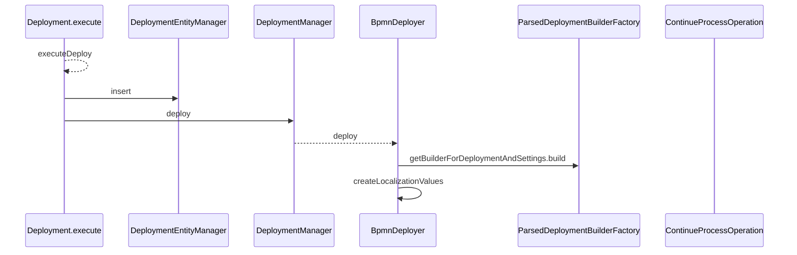
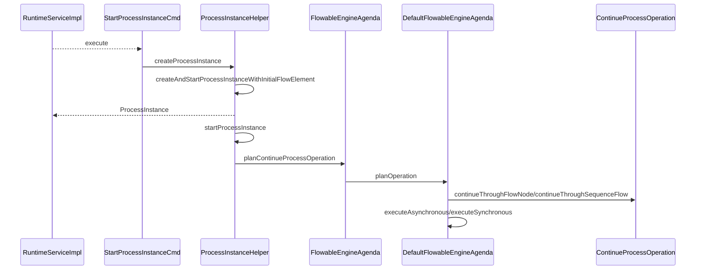

> {{ page.description }}

使用 ChatGPT 理解源码

# 前言
对于业务型的系统还是考虑其设计和应用,源码深入剖析远远没有必要,只需要点到为止即可。

`Flowable` 是 Fork 了 Activiti 的分支，基础结构基本一样，在功能特性上做了一些细微的调整。Flowable 支持 [BPMN](https://tkjohn.github.io/flowable-userguide/#bpmn20) SOP规范


**JavaDelegate** 和 **ActivityBehavior** 接口能力分析

## JavaDelegate
概述
    接口位置：`org.flowable.engine.delegate.JavaDelegate`
    主要功能：用于在流程执行中执行自定义的业务逻辑。
典型场景：用户需要在流程的某个任务节点上执行具体的业务逻辑，例如调用外部服务、处理业务数据等。
具体用法
    `JavaDelegate`接口有一个方法`execute(DelegateExecution execution)`，需要实现该方法来编写具体的业务逻辑。

```java
public class MyJavaDelegate implements JavaDelegate {

    @Override
    public void execute(DelegateExecution execution) {
        // 自定义的业务逻辑
        System.out.println("Executing my custom business logic");
        // 可以通过execution对象访问流程变量
        String myVariable = (String) execution.getVariable("myVariable");
        // 进行业务处理
        execution.setVariable("myVariable", myVariable + " processed");
    }
}
```

## ActivityBehavior

概述
    接口位置：`org.flowable.engine.impl.delegate.ActivityBehavior`
    主要功能：定义流程中活动节点的行为，通常由Flowable内部使用来实现BPMN规范中的各种活动行为（例如任务、网关、事件等）。
    典型场景：用户自定义复杂活动节点行为时，或扩展Flowable引擎时使用。
具体用法
    `ActivityBehavior`接口有一个方法`execute(ActivityExecution execution)`，需要实现该方法来定义活动节点的行为。

```java
public class MyActivityBehavior implements ActivityBehavior {

    @Override
    public void execute(ActivityExecution execution) {
        // 自定义的活动行为逻辑
        System.out.println("Executing custom activity behavior");
        // 处理后，手动触发流程的后续流转
        execution.leaveActivityViaGatewayOrContinue();
    }
}
```
## 主要区别

用途和场景：

    JavaDelegate：主要用于在流程执行过程中调用自定义的业务逻辑，适用于服务任务等场景。
    ActivityBehavior：用于定义流程中活动节点的具体行为，适用于自定义或扩展流程引擎内部行为。

接口方法：
    JavaDelegate：只有一个方法execute(DelegateExecution execution)，用于执行自定义的业务逻辑。
    ActivityBehavior：只有一个方法execute(ActivityExecution execution)，用于定义活动节点的行为。

复杂度和灵活性：
    JavaDelegate：相对简单，主要用于实现具体的业务逻辑。
    ActivityBehavior：更灵活和复杂，主要用于实现自定义活动节点行为，适用于扩展流程引擎的场景

 在包 `org.flowable.engine.impl.bpmn.behavior` 可以看大大多数常用的`Flowable`官方定义的流程引擎   

## FLowable 部署过程



**这里有个区别**
当使用 `XML` 文件部署的时候会自动创建 ProcessDefinition 但是当使用 BPMNModel 部署的时候会出现
部署后没有 ProcessDefinition 的情况。出现这样的问题是因为 ResourceName 的问题。
代码如下：

```java
    public ParsedDeployment build() {
        // ....
        DeploymentEntity deploymentEntity = (DeploymentEntity) deployment;
        for (EngineResource resource : deploymentEntity.getResources().values()) {
            if (isBpmnResource(resource.getName())) {
        // ....
            }
        }
        return new ParsedDeployment(deploymentEntity, processDefinitions,
                processDefinitionsToBpmnParseMap, processDefinitionsToResourceMap);
    }

    public static final String[] BPMN_RESOURCE_SUFFIXES = new String[] { "bpmn20.xml", "bpmn" };

    protected boolean isBpmnResource(String resourceName) {
        for (String suffix : ResourceNameUtil.BPMN_RESOURCE_SUFFIXES) {
            if (resourceName.endsWith(suffix)) {
                return true;
            }
        }

        return false;
    }    
```

## Flowable 执行过程




---
参考：
